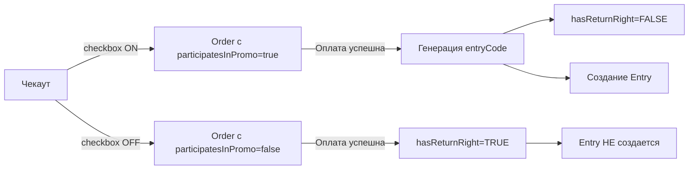

# Fashion Shop - Документация

Добро пожаловать в полную документацию проекта Fashion Shop!

## 📚 Содержание

### Для начала работы

1. **[README.md](../README.md)** - Главный README проекта
   - Обзор проекта
   - Быстрый старт
   - Установка и деплой
   - Основные возможности

2. **[QUICK-REFERENCE.md](./QUICK-REFERENCE.md)** ⚡ - Быстрая шпаргалка
   - Команды и URL
   - Тестовые учетки
   - Частые проблемы
   - Краткие примеры кода

### Техническая документация

3. **[DATABASE-SCHEMA.md](./DATABASE-SCHEMA.md)** 💾 - Схема базы данных
   - Все таблицы и поля
   - Связи между моделями
   - Критическая логика акции
   - Примеры запросов

4. **[API-ENDPOINTS.md](./API-ENDPOINTS.md)** 📡 - API документация
   - Все endpoint'ы с примерами
   - Request/Response форматы
   - Коды ошибок
   - Webhook'и

5. **[DEVELOPMENT-GUIDE.md](./DEVELOPMENT-GUIDE.md)** 🛠️ - Руководство разработчика
   - Добавление нового функционала
   - Работа с формами
   - Тестирование
   - Debugging
   - Best practices

### Специальные документы

6. **[PROVABLY-FAIR-RANDOMIZER.md](../PROVABLY-FAIR-RANDOMIZER.md)** 🎲 - Честная система розыгрышей
   - Как работает Provably Fair
   - Алгоритм SHA-256
   - Проверка результатов
   - Примеры использования

## 🎯 Быстрая навигация по задачам

### "Хочу запустить проект локально"

→ [README.md - Раздел "Локальный запуск"](../README.md#-локальный-запуск-разработка)

```bash
npm install
docker-compose up -d
npx prisma db push
npm run db:seed
npm run dev
```

### "Хочу понять схему БД"

→ [DATABASE-SCHEMA.md](./DATABASE-SCHEMA.md)

Особое внимание:
- **Orders** - логика акции (participatesInPromo, hasReturnRight, entryCode)
- **Entry** - коды участия
- **Draw** - розыгрыши с Provably Fair

### "Хочу добавить новый API endpoint"

→ [DEVELOPMENT-GUIDE.md - Раздел "Новый API endpoint"](./DEVELOPMENT-GUIDE.md#2-новый-api-endpoint)

```typescript
// app/api/my-endpoint/route.ts
export async function GET(request: NextRequest) {
  // ...
}
```

### "Хочу провести розыгрыш"

→ [PROVABLY-FAIR-RANDOMIZER.md](../PROVABLY-FAIR-RANDOMIZER.md)

```typescript
import { conductDraw } from '@/lib/utils/drawRandomizer'
const result = await conductDraw(drawId, 1, 'PUBLIC-SEED')
```

### "Хочу посмотреть все API"

→ [API-ENDPOINTS.md](./API-ENDPOINTS.md)

Основные:
- `POST /api/checkout` - создать заказ
- `POST /api/payment/callback/mock` - webhook
- `GET /api/draws` - список розыгрышей
- `POST /api/admin/draw/conduct` - провести розыгрыш

### "Где тестовые учетки?"

→ [QUICK-REFERENCE.md - Раздел "Тестовые учетные записи"](./QUICK-REFERENCE.md#-тестовые-учетные-записи)

```
Админ: admin@fashion.local / Admin123!@#
Покупатель: customer@test.local / Customer123!
```

## 🔑 Ключевые концепции

### 1. Акция "1 покупка = 1 шанс"

**Критическая логика:**



**Файлы:**
- `app/checkout/page.tsx` - UI checkbox'а
- `app/api/checkout/route.ts` - создание заказа
- `app/api/payment/callback/mock/route.ts` - генерация кода после оплаты

### 2. Entry Code - формат уникального кода

```
TTTTTTTT-RRRR-C

T = Timestamp (8 символов base36)
R = Random (4 символа base36)
C = Checksum (1 символ)

Емкость: 36^4 = 1,679,616 кодов/мс
Поддержка: 50,000+ участников
```

**Файлы:**
- `lib/utils/format.ts` - функция генерации
- `lib/utils/generateUniqueEntryCode.ts` - с проверкой коллизий

### 3. Provably Fair - честные розыгрыши

**Алгоритм:**

```typescript
const hash = SHA-256(serverSeed + ":" + clientSeed + ":" + nonce)
const randomNumber = parseInt(hash.substring(0, 8), 16)
const winnerIndex = randomNumber % totalParticipants
```

**Прозрачность:**
1. **ДО** розыгрыша публикуется: хеш server seed + client seed
2. **ПОСЛЕ** розыгрыша публикуется: сам server seed
3. Любой может проверить: `SHA-256(serverSeed) === serverSeedHash`

**Файлы:**
- `lib/utils/drawRandomizer.ts` - полная реализация
- `scripts/test-provably-fair-randomizer.ts` - демо

### 4. Билеты с взвешенными шансами

**Тиры:**
- **Стандарт** (1,990 ₽) → weight: 1
- **VIP** (4,990 ₽) → weight: 3
- **Premium** (9,990 ₽) → weight: 5

При покупке билета создается Entry с соответствующим весом.

## 📂 Структура проекта

```
fashion-shop/
├── README.md                         # Главный README
├── PROVABLY-FAIR-RANDOMIZER.md       # Документация рандомайзера
│
├── DOCS/                             # Вся документация
│   ├── README.md                     # Этот файл (индекс)
│   ├── QUICK-REFERENCE.md            # Быстрая шпаргалка
│   ├── DATABASE-SCHEMA.md            # Схема БД
│   ├── API-ENDPOINTS.md              # API документация
│   └── DEVELOPMENT-GUIDE.md          # Руководство разработчика
│
├── app/                              # Next.js приложение
├── components/                       # React компоненты
├── lib/                              # Утилиты и библиотеки
├── prisma/                           # Prisma схема и миграции
├── public/                           # Статика
├── scripts/                          # Тестовые скрипты
│
├── docker-compose.yml                # Docker (postgres, redis)
├── ecosystem.config.sample.js        # PM2 конфиг
├── nginx.conf.sample                 # Nginx конфиг
├── Makefile                          # Команды
└── package.json
```

## 🆘 Получить помощь

### Частые проблемы

См. [QUICK-REFERENCE.md - Частые проблемы](./QUICK-REFERENCE.md#-частые-проблемы)

### Debugging

См. [DEVELOPMENT-GUIDE.md - Debugging](./DEVELOPMENT-GUIDE.md#debugging)

### Логи

```bash
# Dev сервер
Смотрите терминал

# Production (pm2)
pm2 logs fashion-shop

# Nginx
sudo tail -f /var/log/nginx/error.log

# Database
docker logs fashion-shop-db

# Redis
docker logs fashion-shop-redis
```

## 🔄 Обновление документации

При добавлении нового функционала, пожалуйста:

1. Обновите соответствующий раздел в документации
2. Добавьте примеры кода
3. Обновите API документацию если есть новые endpoint'ы
4. Обновите DATABASE-SCHEMA.md если изменилась схема
5. Укажите дату обновления в конце документа

## 📝 История изменений

| Дата | Версия | Изменения |
|------|--------|-----------|
| 23.10.2025 | 1.0 | Первая версия полной документации |

## 👥 Вклад в проект

Для разработчиков, работающих над проектом:

1. Изучите [DEVELOPMENT-GUIDE.md](./DEVELOPMENT-GUIDE.md)
2. Следуйте Git workflow (feature branches)
3. Пишите тесты для нового функционала
4. Обновляйте документацию
5. Используйте Conventional Commits

## 🎓 Для новых разработчиков

### День 1: Знакомство
1. Прочитайте [README.md](../README.md)
2. Запустите проект локально
3. Изучите [DATABASE-SCHEMA.md](./DATABASE-SCHEMA.md)
4. Посмотрите структуру `app/` и `components/`

### День 2: Погружение
1. Изучите [API-ENDPOINTS.md](./API-ENDPOINTS.md)
2. Протестируйте основные flow (регистрация → покупка → розыгрыш)
3. Прочитайте [PROVABLY-FAIR-RANDOMIZER.md](../PROVABLY-FAIR-RANDOMIZER.md)
4. Запустите тестовые скрипты из `scripts/`

### День 3: Практика
1. Изучите [DEVELOPMENT-GUIDE.md](./DEVELOPMENT-GUIDE.md)
2. Создайте тестовую фичу (новый endpoint или компонент)
3. Напишите простой тест
4. Сделайте pull request

## 🔗 Внешние ресурсы

- [Next.js Documentation](https://nextjs.org/docs)
- [Prisma Documentation](https://www.prisma.io/docs)
- [Tailwind CSS](https://tailwindcss.com/docs)
- [ЮKassa API](https://yookassa.ru/developers/api)
- [Provably Fair на Wikipedia](https://en.wikipedia.org/wiki/Provably_fair_algorithm)

---

## 📮 Контакты

Для вопросов по проекту создайте issue в репозитории.

---

**Документация создана:** 23 октября 2025
**Автор:** Claude (Anthropic)
**Версия:** 1.0

**Приятной разработки! 🚀**
